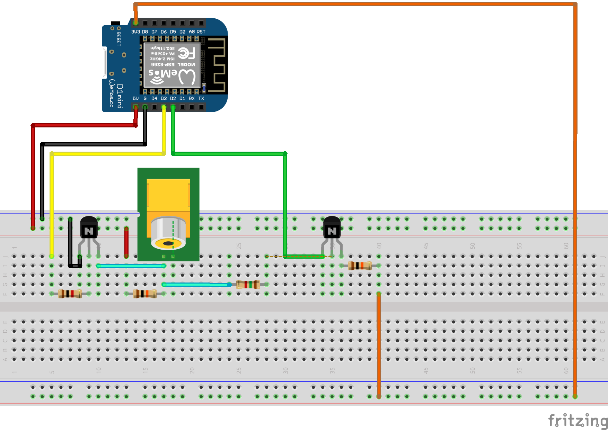
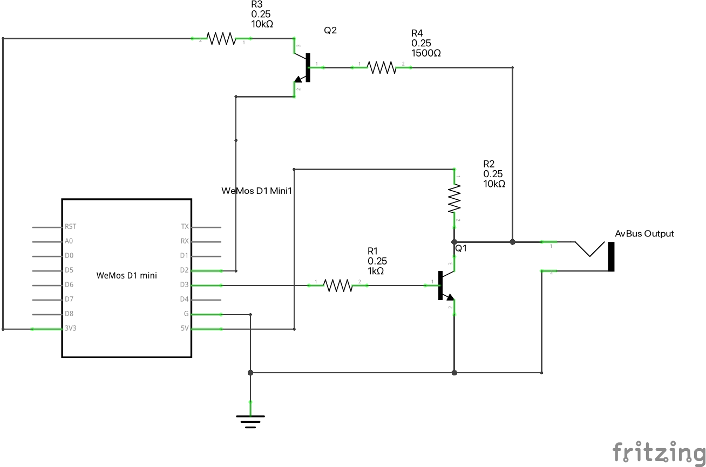

# AVBus Protocol

This Project aims to reverse engineer the AVBus protocol of the Marantz ST560 Stereo Tuner.

Using the AVBus protocol it is also possible to control multiple HiFi devices from that device line, for example the PM451 Amplifier.

The main purpose of this repo is to serve as documentation.
The code in here were my first attempts and I'll consider removing them.

Instead there's an implementation of the protocol for [ESPHome](https://esphome.io/).
For details have a look at the [ESPHome Section](#esp-home-integration), or check out the sources in the [AVBus Fork](https://github.com/jodoll/esphome) of ESPHome.

## Devices

### RMC-20AV


### ST560


##### AV-Bus Jacks


### PM-451


## Ports
* There seems to be no difference between the IN and OUT jack
* It seems like most of the frames are sent on the Remote Control Bus (the orange one).
I currently have no clue what the EasyBus (green) is for.
* Voltage on the bus is 5V
* The default state of the Bus signal is `HIGH`.

## Protocol
The following section describes the protocol.

> DISCLAIMER: The captures shown in the screenshots were captured with [sigrok/PulseView](https://sigrok.org/wiki/Main_Page)

### Frame

> NOTE: Not the full Footer is shown here as it is much to long.

Each frame has the following structure:

| Header | Data | Footer |
|:-|:-|:-|
| 10ms | 8 Bits a 1ms | 282 ms |

This sums up to 300ms for each transmitted signal.
The Header and Footer pull the bus to `LOW`.

### Bits

A bit is 1ms long. The bus is pulled to `HIGH` to start a bit and then pulled to `LOW`.
For a `1` the the `HIGH` phase lasts for `300us` for a `0` for `700us`.
The remaining time the bus is at `LOW`.

| 1 | 0 |
|:-:| :-:|
|||
| 300us `HIGH` | 700us `HIGH` |

### Data
The data section of each frame consists of 8 bits.
It seems like the first 3 Bits define the device and the remaining ones the command.

> WARNING:
> 
> The commands never overlap so maybe it's just a coincidence that the devices start with the same 3 bits. 
> On top of that, some commands for TV that should be sent aren't.
> Some investigation is needed whether they may be sent on the EasyBus.

Let's take the following capture of the `Amp | Volume Down` command as an example:


The first three bits are `0b101` or `5` which corresponds to `Amp`.


The last five bits are the command, which are `0b11101` or `0xD` which in turn means `Volume Down` when combined with `Amp`.

### Repeat

To repeat a signal the Footer is just extended by keeping the bus at `LOW` for the time the key is held on the remote.
Exact timings need to be checked.

## Codes

| Device | Address | Function | Command | 
| :-: | :-: | :-: | :-: |
| Amp | `5` | Vol+ (Front) | `0x1E` | 
|     |     | Vol- (Front) | `0x1D` |
|     |     | Vol+ (Rear) | `0x02` |
|     |     | Vol- (Rear) | `0x12` |
|     |     | Mute | `0x13` |
|     |     | Tuner | `0x0A` |
|     |     | Phono | `0x08` |
|     |     | CD | `0x11` |
|     |     | Tape | `0x18` |
|     |     | TV | `0x09` |
|     |     | Video | `0x07` |
|     |     | VCR | `0x06` |
| Tuner | `6` | AM | `0x05` | 
|       |     | FM | `0x04` | 
|       |     | Tune Down | `0x00` | 
|       |     | Tune Up | `0x01` | 
|       |     | 1 | `0x0E` | 
|       |     | 2 | `0x0D` | 
|       |     | 3 | `0x0C` | 
|       |     | 4 | `0x0B` | 
|       |     | 5 | `0x0A` | 
|       |     | 6 | `0x09` | 
|       |     | 7 | `0x08` | 
|       |     | 8 | `0x07` | 
| Tape | `3` | Play | `0x1E` | 
|      |     | Stop | `0x1B` | 
|      |     | Rewind | `0x1D` | 
|      |     | Forward | `0x1C` | 
|      |     | Pause | `0x1A` | 
|      |     | Record | `0x12` | 
|      |     | Record Mute | `0x18` | 
|      |     | Direction | `0x15` | 
|      |     | Index Scan | `0x19` | 
|      |     | QMS | `0x14` | 
|      |     | Memo | `0x17` | 
| Phono | `6` | Play | `0x1E` | 
|       |     | Cut | `0x1B` | 
|       |     | Cue | `0x1A` | 
|       |     | Repeat | `0x16` | 
| VCR | `2` | Selector | `0x15` | 
|     |     | Memo | `0x17` | 
|     |     | Record Mute | `0x18` | 
| TV | `7` | Play/Next | `0x1E` | 
|     |     | Stop/C | `0x1B` | 
|     |     | Pause | `0x1A` | 
|     |     | Repeat | `0x16` | 
| System | `1` | 1 | `0x1B` | 
|        |     | 2 | `0x1A` | 

## ESP Home Integration

I found it very convenient to integrate this protocol into [ESPHome](https://esphome.io).
With a little bit of circuitry, an ESP and some spare time, you will quickly be up an running.

If you haven't done so, start with setting ESPHome by following their guide. 

To use the AVBus Protocol you can find a ready made custom component [here](https://github.com/jodoll/esphome).
### Configuration
To use the custom component, include it in you ESPHome device config:

```yaml
external_components:
  # use remote_receiver/remote_transmitter with AvBus support
  - source:
      type: git
      url: https://github.com/jodoll/esphome
      ref: avbus_protocol
    components: [ remote_receiver, remote_base, remote_transmitter ]
```

Then follow the instructions for [remote transmitter/receiver](https://esphome.io/components/remote_transmitter.html) in the official documentation.

#### Receiver
When including the external component, there's the `avbus` protocol available.
Make sure you set `idle` to at least `11ms`, as the Header of the protocol is `10ms` long.
When using a value that is too big, the receiver might not be able to decode values in fast sequence (it needs to wait until the signal is completed (idle) before moving on with the next one).
I found that `20ms` works quite well.

```yaml
remote_receiver:
  dump: avbus
  pin: D2
  idle: 20ms
```

#### Transmitter
There's nothing special about the transmitter, just make sure to set `carrier_duty_percent` to `100%`.

```yaml
remote_transmitter:
  pin: D3
  carrier_duty_percent: 100%
```

#### Devices & Co.
Defining switches, automations, etc. is similar to other protocols, just us `avbus` as name.

```yaml
# Individual switches
switch:
  - platform: template
    name: "AvBus Amp Vol Up"
    turn_on_action:
      remote_transmitter.transmit_avbus:
        address: 5
        command: 0x1E
```

### Circuit
Here's how I've done the wiring for my ESPHome.
It' might not be perfect, but it seems to work.

Note that the inversion of the signal for the receiver is (probably) not needed, as ESPHome will detect what's idle and will adjust accordingly.  
On the transmitting side, however, signal inversion is a must.

> CAUTION: The bus works at `5V` while ESPs work at `3,3V`.
> Don't just connect the bus to a pin without a transistor.
> You'll damage your ESP!





### Used Parts

| Name | Description | Amount |
| ---- | ----------- | ------ |
| Q1, Q2 | BC547B | 2 |
| R1 | Resistor 1 kOhm | 1 |
| R2, R3 | Resistor 10 kOhm | 2 |
| R4 | Resistor 1500 Ohm | 1 |
| AvBus Output | RCA Jack | 1 |

## Third Party Software

* [ArduinoJson](https://github.com/bblanchon/ArduinoJson) ([MIT](https://github.com/bblanchon/ArduinoJson/blob/6.x/LICENSE.md))
* [Arduino Core Avr](https://github.com/arduino/ArduinoCore-avr)
* [Arduino Core Esp32](https://github.com/espressif/arduino-esp32) ([LGPL v2.1](https://github.com/espressif/arduino-esp32/blob/master/LICENSE.md))
* [DS3231](https://github.com/jarzebski/Arduino-DS3231) ([GPL v3](https://github.com/jarzebski/Arduino-DS3231/blob/master/LICENSE))
* [ESP Async WebServer](https://github.com/me-no-dev/ESPAsyncWebServer) (LGPL v3)
* [FS](https://github.com/espressif/arduino-esp32/blob/master/libraries/FS/src/FS.h) (LGPL v2.1)
* [PathVariableHandlers](https://github.com/sidoh/path_variable_handlers) ([MIT](https://github.com/sidoh/path_variable_handlers/blob/master/LICENSE))
* [RichHttpServer](https://github.com/sidoh/rich_http_server) ([MIT](https://github.com/sidoh/rich_http_server/blob/master/LICENSE))
* [Update](https://github.com/espressif/arduino-esp32) ([LGPL v2.1](https://github.com/espressif/arduino-esp32/blob/master/LICENSE.md))
* [WebServer]() ([LGPL v2.1](https://github.com/espressif/arduino-esp32/blob/master/LICENSE.md))
* [WiFi](http://www.arduino.cc/en/Reference/WiFi) (LGPL v2.1
* [Wire](http://arduino.cc/en/Reference/Wire) (LGPL v2.1)

## Todo
### Electrical
- [ ] It seems the ST560 somehow get's stuck and doesn't accept any singnals from an actual remote control anymore when the ESP restarts while connected
### Protocol
- [x] Record and protocol all signals
- [X] Narrow down timings for HEADER, 0, 1 and FOOTER
- [ ] What's the threshold where FOOTER makes a device repeat the command 

### Documentation
- [x] Add diagram of wiring
- [x] Add diagram of the bus signals
