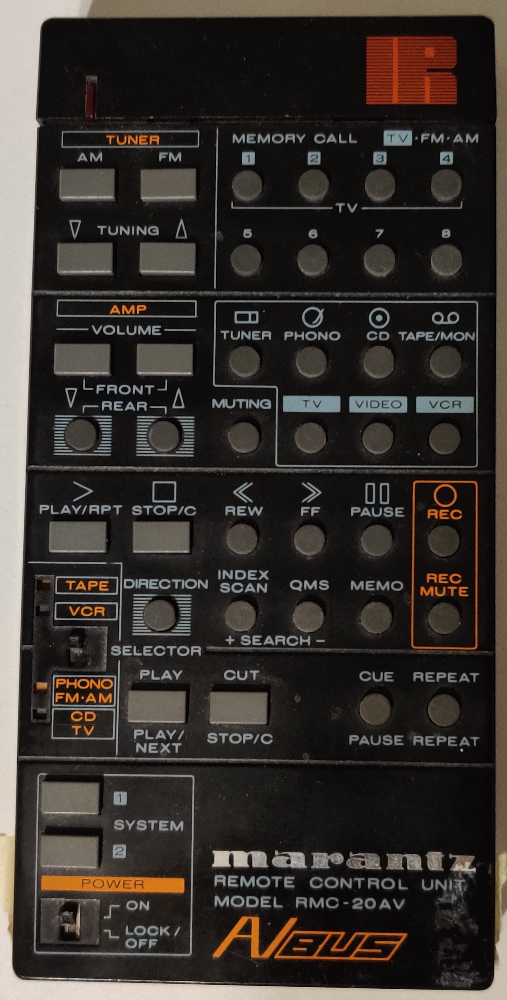
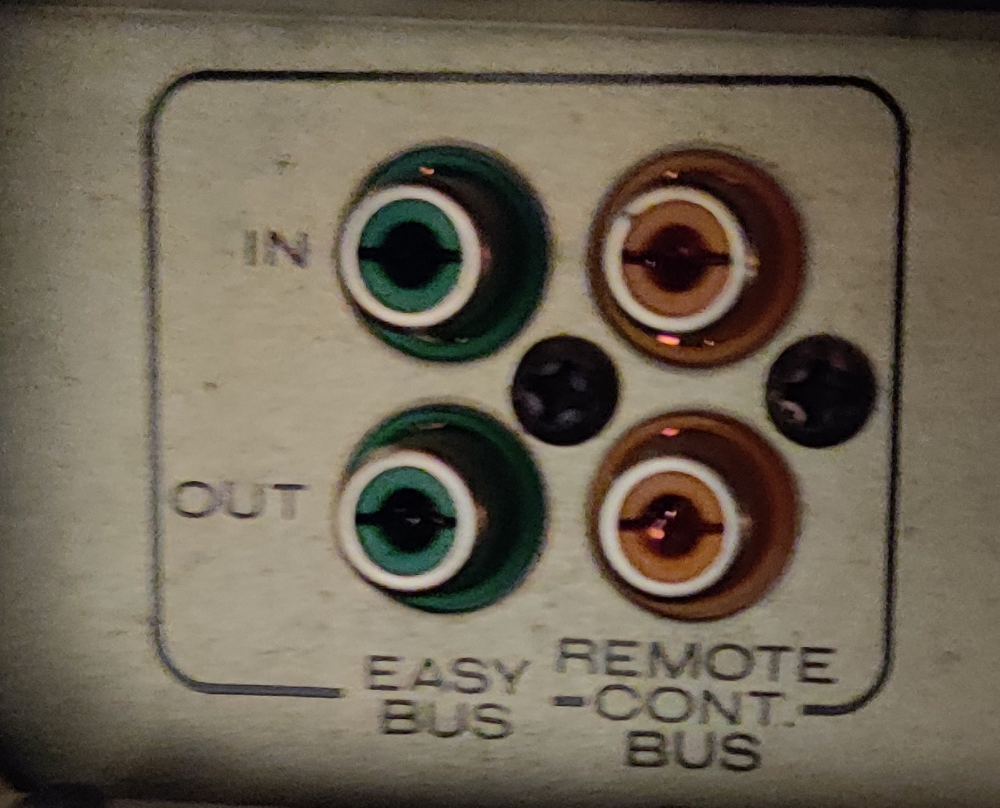
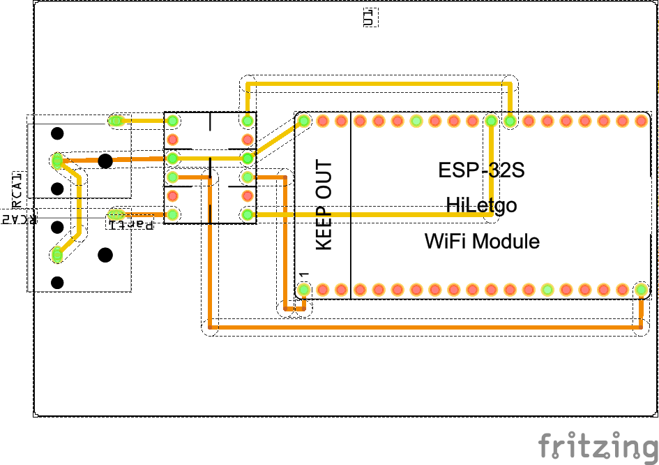
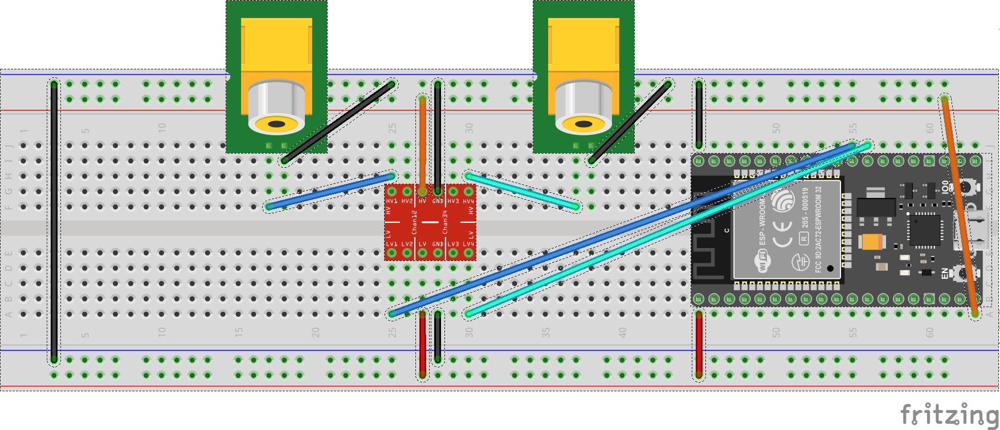
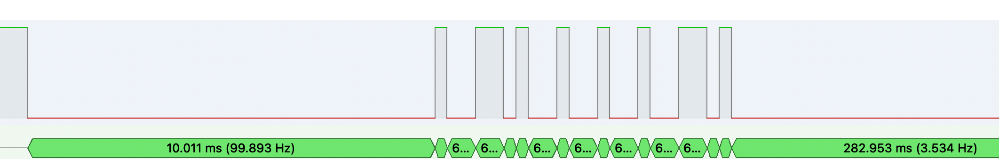
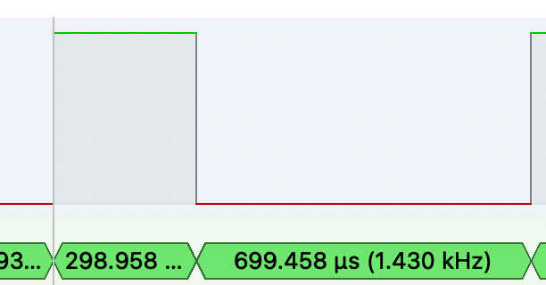
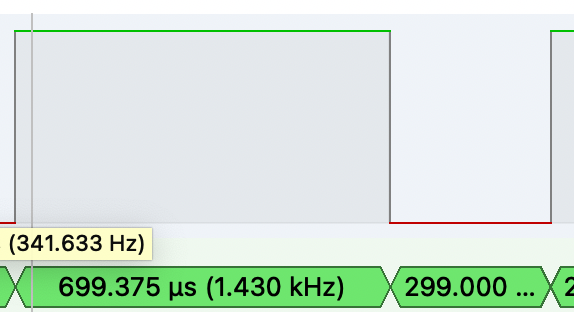
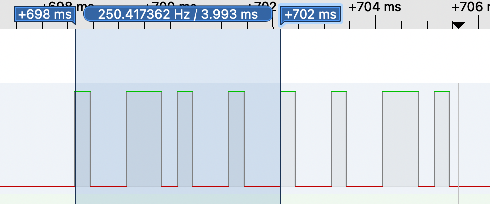
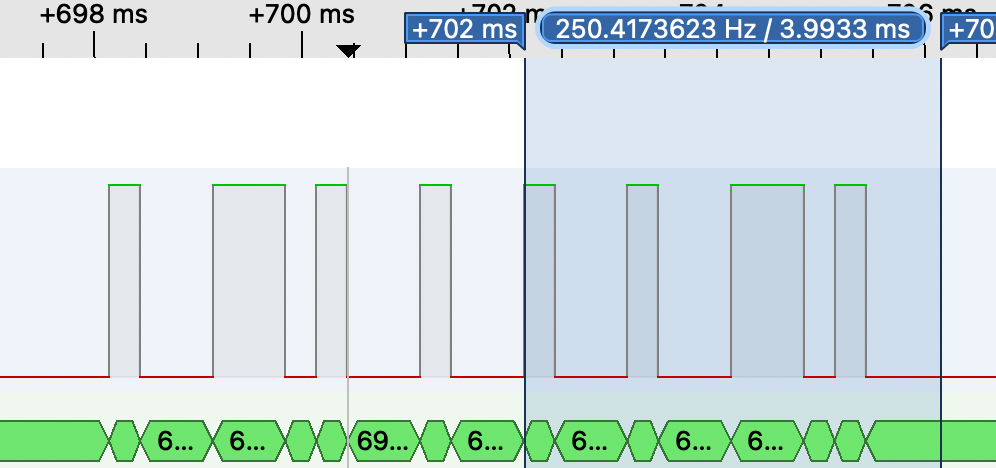

# Arduino AVBus

This Project aims to reengineer the AVBus protocol of the Marantz ST560 Stereo Tuner.

Using the AVBus protocol it is also possible to control multiple HiFi devices from that device line, for example the PM451 Amplifier.

## Devices

### RMC-20AV

### ST560

##### AV-Bus Jacks

### PM-451

## Building
The project is built with [PlatformIO](https://platformio.org/). Their version of Visual Studio code is used to built the project. Please refer to their documentation on how to setup their SDK. 

Afterwards the project can be opened and should work out of the box on a mac, provided you have set up your USB drivers. For other platforms you may need to add a config to the [platformio.ini](platformio.ini). Please refer to PlatformIO for [instructions](https://docs.platformio.org/en/latest/projectconf.html) on how to do so.

## Project Setup

The 32kHz output of a DS3231 is used to generate a clock signal to measure the time between bus signal changes. The signal is connected to one of the interrupt pins of the Arduino Uno (Pin 2).

The other interrupt pin (Pin 3) is connected to the Remote Control line of the AVBus. Every time the bus changes state the time is stored. 

Notes:
* There seems to be no difference between the IN and OUT jack
* Writing to the bus while reading seems possible, but the input from the RMC-20AV seems to be blocked (See [Todo](#Todo))

### Circuit
Breadboard and PCB design were created with [Fritzing](https://fritzing.org/).  
The Fritzing source file can be found in [circuit](circuit/).

#### ESP32
**PCB**  

**Breadboard**  

[AvBus_Esp32.fzz](circuit/AvBus_Esp32.fzz)

## Protocol
The following section describes the protocol.

> DISCLAIMER: The captures shown in the screenshots were captured with [sigrok/PulseView](https://sigrok.org/wiki/Main_Page)

### Frame
The default state of the Bus signal is `HIGH`.

Each frame has the following structure:
| Init  | Data         | Outro  |
|-------|--------------|--------|
| 10ms | 8 Bits a 1ms | 282 ms |

> NOTE: Not the full outro is shown here as it is much to long.

This sums up to 300ms for each transmitted signal.
The Init and Outro pull the bus to `LOW`.

### Bits

A bit is 1ms long. The bus is pulled to `HIGH` to start a bit and then pulled to `LOW`.
For a `1` the the `HIGH` phase lasts for `300us` for a `0` for `700us`.
The remaining time the bus is at `LOW`.

| 1 | 0 |
|:-:| :-:|
|||
| 300us `HIGH` | 700us `HIGH` |

### Data
The data section of each frame consists of 8 bits.
The first four for the Device and the other four for the command.

Let's take the following capture of the `Amp | Volume Down` command as an example:

The marked part corresponds to the first four Bits which define the device. They are `0b1011` or `0xB` which corresponds to `Amp`.

The command is `0b1101` or `0xD` which means `Volume Up` when combined with `Amp`.

## Third Party Software

* [ArduinoJson](https://github.com/bblanchon/ArduinoJson) ([MIT](https://github.com/bblanchon/ArduinoJson/blob/6.x/LICENSE.md))
* [Arduino Core Avr](https://github.com/arduino/ArduinoCore-avr)
* [Arduino Core Esp32](https://github.com/espressif/arduino-esp32) ([LGPL v2.1](https://github.com/espressif/arduino-esp32/blob/master/LICENSE.md))
* [DS3231](https://github.com/jarzebski/Arduino-DS3231) ([GPL v3](https://github.com/jarzebski/Arduino-DS3231/blob/master/LICENSE))
* [ESP Async WebServer](https://github.com/me-no-dev/ESPAsyncWebServer) (LGPL v3)
* [FS](https://github.com/espressif/arduino-esp32/blob/master/libraries/FS/src/FS.h) (LGPL v2.1)
* [PathVariableHandlers](https://github.com/sidoh/path_variable_handlers) ([MIT](https://github.com/sidoh/path_variable_handlers/blob/master/LICENSE))
* [RichHttpServer](https://github.com/sidoh/rich_http_server) ([MIT](https://github.com/sidoh/rich_http_server/blob/master/LICENSE))
* [Update](https://github.com/espressif/arduino-esp32) ([LGPL v2.1](https://github.com/espressif/arduino-esp32/blob/master/LICENSE.md))
* [WebServer]() ([LGPL v2.1](https://github.com/espressif/arduino-esp32/blob/master/LICENSE.md))
* [WiFi](http://www.arduino.cc/en/Reference/WiFi) (LGPL v2.1
* [Wire](http://arduino.cc/en/Reference/Wire) (LGPL v2.1)

## Todo
### Protocol
- [x] Record and protocol all signals
- [ ] Narrow down timings for INIT, 0, 1 and HOLD
- [ ] What's the threshold where HOLD makes a device repeat the command 

### Circuit
- [x] Check if the DS3231 signal is required (at least not for ESP32)
- [ ] Do not block the bus to allow for side by side operation with RMC-20AV

### Documentation
- [x] Add diagram of wiring
- [ ] Add diagram of the bus signals
- [ ] Add REST api documentation

### Features
- [x] Allow sending of arbitrary commands
- [x] ESP32 port to support a webserver/bt
- [x] Add a Webserver on ESP32
- [ ] Android app to act as a remote control (check the status of the project [here](https://github.com/jodoll/avbus_android/))
